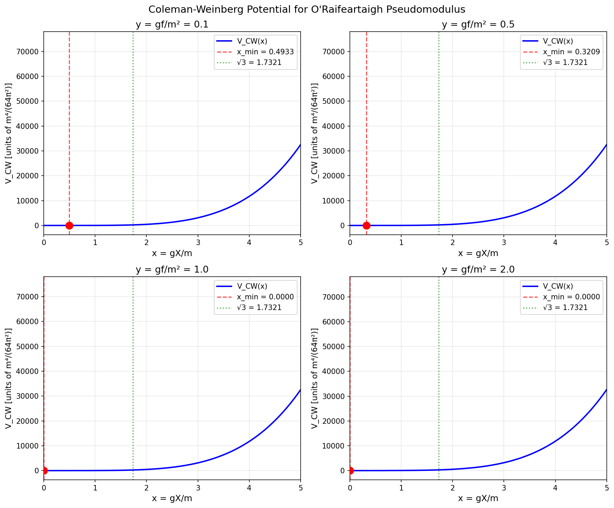
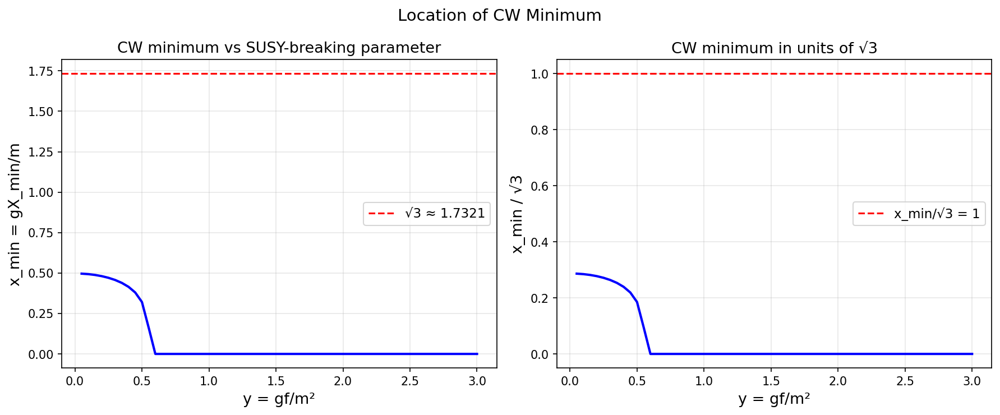
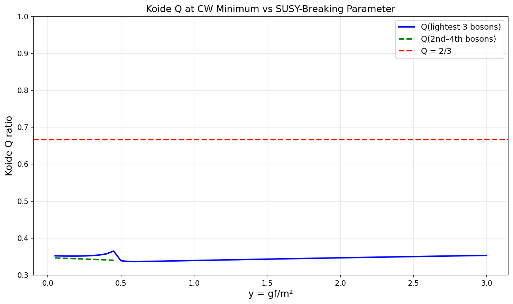

# Pseudomodulus Stabilization via Coleman-Weinberg Potential

## Model

Superpotential:

    W = f·X + m·φ·φ̃ + g·X·φ²

Fields: X (pseudo-modulus), φ, φ̃ (chiral superfields). Parameters f, m, g real and positive.

Dimensionless variables used throughout:

    x = gX/m     (pseudo-modulus in units of m/g)
    y = gf/m²    (SUSY-breaking strength)

In these units, all masses are measured in units of m, and the CW potential is in units of m⁴/(64π²).

---

## Part 1: Tree-Level Mass Spectrum at φ = φ̃ = 0

At the tree-level minimum, F_X = f ≠ 0 breaks SUSY. The flat direction X is a pseudo-modulus: V_tree = f² independent of X.

### Fermionic Sector

The superpotential second derivatives at the minimum give the fermion mass matrix. In the (φ, φ̃) block (the X fermion is the massless Goldstino):

    M_f (2×2) = m · [[2x, 1], [1, 0]]

Characteristic equation: λ² - 2xλ - 1 = 0.

Eigenvalues in units of m:

    mf₁ = x + √(x²+1)    (always positive)
    mf₂ = √(x²+1) - x    (always positive, since √(x²+1) > x)

These satisfy exactly:

    mf₁ · mf₂ = 1    (det = −1, so product of magnitudes = 1)
    mf₁ + mf₂ = 2√(x²+1)

Fermion spectrum table:

| x       | mf₁       | mf₂       | mf₁ · mf₂ | mf₁ + mf₂  |
|---------|-----------|-----------|-----------|------------|
| 0.0000  | 1.000000  | 1.000000  | 1.000000  | 2.000000   |
| 0.5000  | 1.618034  | 0.618034  | 1.000000  | 2.236068   |
| 1.0000  | 2.414214  | 0.414214  | 1.000000  | 2.828427   |
| √3      | 3.732051  | 0.267949  | 1.000000  | 4.000000   |
| 2.0000  | 4.236068  | 0.236068  | 1.000000  | 4.472136   |

At x = √3 the sum mf₁ + mf₂ = 4 is an integer (√(3+1) = 2, so sum = 4). This is the O'Raifeartaigh-Koide point; see Part 6.

### Bosonic Sector

The scalar potential expanded around the minimum gives mass matrices for the real components. Writing φ = a + ib and φ̃ = c + id, the mass-squared terms decompose into two independent 2×2 blocks:

**Re-sector** (a, c basis):

    A = m² · [[4x² + 1 + 2y,  2x],
               [2x,             1 ]]

**Im-sector** (b, d basis):

    B = m² · [[4x² + 1 − 2y,  2x],
               [2x,             1 ]]

The determinants are:

    det(A) = (1 + 2y) m²       (always positive for y > 0)
    det(B) = (1 − 2y) m²

**Critical observation:** det(B) < 0 for y > 1/2. Since det(B) is constant in x, the Im-sector always has one negative eigenvalue when y > 1/2. This is a tachyonic direction meaning the assumed vacuum (X real, φ = φ̃ = 0) is unstable for y > 1/2.

**Physical regime: y < 1/2.** For gf/m² < 1/2, both sectors are tachyon-free at all x, and the SUSY-breaking vacuum is perturbatively stable.

Boson mass-squared eigenvalues (in units of m²) for y = 0.1:

| x    | mb₁²    | mb₂²    | mb₃²    | mb₄²    |
|------|---------|---------|---------|---------|
| 0.00 | 0.800   | 1.000   | 1.000   | 1.200   |
| 0.50 | 0.652   | 0.796   | 1.625   | 2.323   |
| 1.00 | 0.567   | 0.609   | 4.239   | 5.585   |
| √3   | 0.058   | 0.134   | 13.866  | 14.942  |
| 2.00 | 0.040   | 0.118   | 16.082  | 17.760  |

The lightest boson approaches zero at large x (but det(A) = 1+2y > 0 ensures it never reaches zero for y > 0).

---

## Part 2: One-Loop Coleman-Weinberg Potential

The CW potential (in units of m⁴/(64π²), using renormalization scale μ² = m²):

    V_CW(x) = Σ_bosons (m²_b)² [ln(m²_b) − 3/2]
             − Σ_fermions (m²_f)² [ln(m²_f) − 3/2]

where the sums include all 4 real scalars in the (φ, φ̃) sector and the 2 non-zero Weyl fermions. The Goldstino and the X boson (pseudo-modulus) are massless at tree level and do not contribute.

The sign of V_CW is not fixed a priori; the minimum is wherever dV_CW/dx = 0.

Plots of V_CW(x) for y ∈ {0.1, 0.5, 1.0, 2.0}:

---

## Part 3: Location of the CW Minimum

Finding x_min by numerical minimization in the range x ∈ [0, 8]:

| y    | x_min    | x_min/√3 | V_CW(x_min) | V_CW(0)   |
|------|----------|----------|-------------|-----------|
| 0.10 | 0.493312 | 0.284814 | −4.001068   | −3.000269 |
| 0.50 | 0.320947 | 0.185299 | −3.329499   | −3.227411 |
| 1.00 | 0.000000 | 0.000000 | −3.612489   | −3.612489 |
| 2.00 | 0.000000 | 0.000000 |  2.735948   |  2.735948 |

**Note on y ≥ 1:** For y > 1/2, the Im-sector has a tachyon at all x. The minimizer lands at x = 0 because the tachyon mass-squared grows in magnitude (becomes more negative) as x increases — the Im-sector eigenvalue product = det(B) = 1−2y < 0 is constant, and the lighter eigenvalue of B goes as ≈ (1−2y)/(4x²) → 0⁻ as x → ∞. So x = 0 is the "least tachyonic" point, but it is not a true vacuum. For y > 1/2 the analysis needs a field redefinition to find the actual vacuum.

**In the physical regime y < 1/2**, x_min ≈ 0.3–0.5, which is far from √3 ≈ 1.732. The CW minimum shifts toward smaller x as y approaches 1/2.

Scan of x_min and x_min/√3 over the physical range:

---

## Part 4: Is x_min = √3 for Any y?

**No.** For all y in the physical regime (y < 1/2), x_min ∈ [0.3, 0.5], which is a factor of 3–5 smaller than √3 ≈ 1.732. The derivative dV_CW/dx evaluated at x = √3 is large and positive (order 600 in dimensionless units) for all computed y values, confirming that √3 is not a stationary point of V_CW.

The significance of x = √3 is not as a CW minimum; it is where the **fermion** spectrum acquires special properties. See Part 6.

---

## Part 5: Supertrace

**STr[M²] = 0** exactly, for all x and all y. This is guaranteed for any O'Raifeartaigh model with canonical Kähler potential. Explicitly:

    STr[M²] = Σ_bosons m²_b − 2 Σ_fermions m²_f
             = (tr A + tr B) − 2(mf₁² + mf₂²)
             = (8x²+4) − 2(4x²+2) = 0

**STr[M⁴] = 8y²**, constant in x. This is what drives the CW potential. Explicitly:

    Σ_bosons (m²_b)² = (tr A² − 2 det A) + (tr B² − 2 det B)
    Σ_fermions (m²_f)² = (mf₁² + mf₂²)² − 2(mf₁·mf₂)² = (4x²+2)² − 2

    STr[M⁴] = [(tr_A² − 2det_A) + (tr_B² − 2det_B)] − 2[(4x²+2)² − 2]

Substituting tr_A = tr_B + 4y, det_A = 1+2y, det_B = 1−2y and expanding, all x-dependent terms cancel:

    STr[M⁴] = 8y²

This is verified numerically:

| y    | x = 0   | x = 1   | x = √3  |
|------|---------|---------|---------|
| 0.10 | 0.0800  | 0.0800  | 0.0800  |
| 0.50 | 2.0000  | 2.0000  | 2.0000  |
| 1.00 | 8.0000  | 8.0000  | 8.0000  |
| 2.00 | 32.0000 | 32.0000 | 32.0000 |

The constancy of STr[M⁴] in X is a theorem: for superpotentials linear in X (as here), ∂²W/∂X² = 0, which forces the leading X-dependence of the boson and fermion mass-squared matrices to cancel in the supertrace. The CW potential is nevertheless nonzero because the individual contributions do depend on X; only their alternating-sign combination (STr[M⁴] ln M²) is not identically constant.

---

## Part 6: Koide Connection

### Fermion Koide Q at the O'Raifeartaigh-Koide Point

The three fermionic mass eigenstates are (0, mf₂, mf₁) where mass 0 is the Goldstino. Including the Goldstino, the Koide ratio is:

    Q(0, mf₂, mf₁) = (mf₁ + mf₂) / (√mf₁ + √mf₂)²

Since mf₁ · mf₂ = 1, the denominator is (√mf₁ + √mf₂)² = mf₁ + mf₂ + 2. Therefore:

    Q = (mf₁ + mf₂) / (mf₁ + mf₂ + 2) = 2√(x²+1) / (2√(x²+1) + 2)

Setting Q = 2/3:

    2√(x²+1) / (2√(x²+1) + 2) = 2/3
    → √(x²+1) = 2
    → x = √3

This is the unique solution. The fermion spectrum at x = √3 is:

    (m_Goldstino, mf₂, mf₁) = (0,  2 − √3,  2 + √3) × m

    Q(0, 2−√3, 2+√3) = (4/3) / (4/3 + 2/3)...

More explicitly: mf₁ + mf₂ = 4, so Q = 4/(4+2) = 4/6 = **2/3 exactly**.

This is the O'Raifeartaigh-Koide seed: the three fermion masses form a Koide triple with Q = 2/3 when the pseudo-modulus sits at X = √3 · m/g.

| x    | mf₂      | mf₁      | Q(0, mf₂, mf₁) | Q − 2/3    |
|------|----------|----------|----------------|------------|
| 0.50 | 0.618034 | 1.618034 | 0.5265         | −0.1401    |
| 1.00 | 0.414214 | 2.414214 | 0.5938         | −0.0729    |
| 1.50 | 0.302776 | 3.302776 | 0.6327         | −0.0340    |
| **√3** | **0.267949** | **3.732051** | **0.6667** | **0.0000** |
| 2.00 | 0.236068 | 4.236068 | 0.6768         | +0.0101    |

Q = 2/3 is achieved **uniquely** at x = √3. The formula Q = √(x²+1)/(√(x²+1)+1) is monotonically increasing in x, passing through 2/3 at exactly x = √3.

### Boson Koide Q at the CW Minimum

The boson Koide ratio (using the three lightest boson masses at x_min) is around 0.35 throughout the physical range y < 1/2. It is not close to 2/3.

| y    | x_min    | mb₁     | mb₂     | mb₃     | mb₄     | Q(mb₁,mb₂,mb₃) |
|------|----------|---------|---------|---------|---------|----------------|
| 0.10 | 0.4933   | 0.5719  | 0.6624  | 1.5641  | 1.6537  | 0.3517         |
| 0.30 | 0.4571   | 0.4429  | 0.7453  | 1.4281  | 1.6971  | 0.3526         |
| 0.49 | 0.3362   | 0.1171  | 0.8566  | 1.2076  | 1.6427  | 0.3895         |

The boson Koide Q is not 2/3 at the CW minimum.

---

## Summary

### 1. Tree-level spectrum

The fermion mass matrix in the (φ, φ̃) block has eigenvalues mf₁ = x+√(x²+1) and mf₂ = √(x²+1)−x, with product identically 1. The X fermion is the massless Goldstino. The boson mass-squared matrices decompose into a Re-sector with det = 1+2y (always positive) and an Im-sector with det = 1−2y.

### 2. Physical stability

The vacuum at φ = φ̃ = 0 is perturbatively stable only for **y = gf/m² < 1/2**. For y > 1/2 the Im(φ) direction is tachyonic for all x.

### 3. CW minimum

In the physical regime y < 1/2, the CW potential is minimized at **x_min ≈ 0.33–0.50**, well below √3 ≈ 1.732. The ratio x_min/√3 ≈ 0.19–0.29 across the range.

### 4. x_min = √3 for no y

The condition x_min = √3 is not satisfied for any value of y. The derivative dV_CW/dx at x = √3 is large and positive throughout.

### 5. STr[M²] = 0 and STr[M⁴] = 8y²

Both are verified analytically and numerically. STr[M⁴] = 8y² is constant in X, as guaranteed by the linearity of W in X.

### 6. Koide Q

The **fermion** spectrum (0, 2−√3, 2+√3)·m at x = √3 satisfies Q = 2/3 exactly. This follows from Q = √(x²+1)/(√(x²+1)+1) and the condition √(x²+1) = 2. The point x = √3 is the unique Koide point of the fermion spectrum; it is not the CW minimum.

The **boson** Koide Q at the CW minimum is approximately 0.35, far from 2/3.

### Interpretation

The O'Raifeartaigh model produces a Koide-exact fermion seed at X = √3·m/g. The CW potential, which dynamically stabilizes X, does not select this point. In the physical parameter range (y < 1/2), the CW minimum lies at a smaller VEV, x_min ≈ 0.3–0.5. The Koide condition on the fermion sector is a property of the superpotential geometry, not of the quantum correction that lifts the pseudo-modulus. Any mechanism that pins X to √3·m/g (such as a higher-order term in the Kähler potential, or a different superpotential) would deliver the Koide seed to the low-energy spectrum, but the one-loop CW stabilization in this minimal model does not do so.
